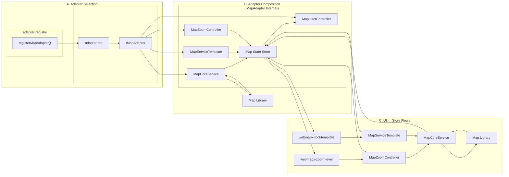

# 🛠️ Developer Experience (DX) Guide: Creating New Modules

This guide outlines the standard procedure for adding a new UI feature (e.g., a Buffer Tool or Location Finder) to maintain architectural consistency and robustness.

## I. Unidirectional Data Flow

The system operates on a strict **Unidirectional Data Flow**. A UI component **NEVER** directly calls a map function that changes state without first updating the Map State Store.


* **UI Component:** Dispatches intent (calls Adapter).
* **Adapter Service:** Translates intent into Map API call.
* **Map API:** Performs action and fires event.
* **Adapter Service:** Captures Map event and pushes resulting data to the **Map State Store**.
* **Map State Store:** Notifies all subscribed UI components.

## II. The Low Complexity Rule

**Rule:** All code for logic, calculations, and state manipulation **MUST** be offloaded from the UI Web Component.

| Task | Where it Belongs | File Path |
| :--- | :--- | :--- |
| **GIS Buffering** | Map Service Template | [`../src/map/maplibre-services/MapServiceTemplate.ts`](../src/map/maplibre-services/MapServiceTemplate.ts) |
| **Opacity Throttling** | Style Adapter Service | [`../src/map/maplibre-services/StyleAdapterService.ts`](../src/map/maplibre-services/StyleAdapterService.ts) |
| **Calculating New State** | Map State Store (actions/reducers) | [`../src/store/map-state-store.ts`](../src/store/map-state-store.ts) |

## III. Building a New Module (The 3-Step Process)

To create a new feature (e.g., `webmapx-tool-template`), follow this process:

### 1. Define the Contract (The Interface)

If your feature requires a new capability, define it in the map interfaces file first.

* **File:** [`../src/map/IMapInterfaces.ts`](../src/map/IMapInterfaces.ts)
* **Action:** Create a new interface (e.g., `INewTool`) defining the methods your UI will call (`INewTool.toggle()`).

### 2. Implement the Service (The Adapter)

Create the concrete implementation that adheres to the new contract and handles robustness.

* **File:** Create a new file in `/src/map/maplibre-services/NewToolAdapterService.ts`.
* **Robustness Check:**
    * **Expensive Call?** If yes, wrap the internal map API call using `throttle()` from [`../src/utils/throttle.ts`](../src/utils/throttle.ts).
    * **Updates State?** If yes, ensure the final state update uses `store.dispatch(newState, 'MAP')` to declare the **source**.

### 3. Build the Component (The UI)

Copy the template and hook it up to the store and adapter.

* **Template:** Start by copying and renaming [`../src/components/modules/webmapx-tool-template.ts`](../src/components/modules/webmapx-tool-template.ts).
* **Subscription:** Ensure the component subscribes to the store and implements the **Temporary Muting** logic (checking `this.isSettingValue` flag) to prevent feedback loops.
* **Styling:** Use only Atomic Components and reference CSS variables (e.g., `var(--color-primary)`) for styling, never hardcoded values.

## IV. Architecture Overview


### Legend & Responsibilities
- MapCoreService: Core map facade (initialize, set zoom, events); library-agnostic via `IMapCore`.
- IMapAdapter: Composite adapter contract in `src/map/IMapAdapter.ts` defining the store, `IMapCore`, `IToolService`, zoom, and inset controllers required by `webmapx-map`.
- Adapter Registry: `src/map/adapter-registry.ts` exposes `registerMapAdapter()` and `createMapAdapter()` so each `<webmapx-map>` can select an implementation via its `adapter` attribute (defaults to `maplibre`).
- MapZoomController: Orchestrates zoom UX; binds to core, throttles UI intents, relays map zoom-end to store.
- MapServiceTemplate: Template for tool services; encapsulates map operations with throttling; updates store.
- Map State Store: Single source of truth per adapter; components subscribe; updates tagged with source ('UI'|'MAP'|'INIT').
- Components: Plugin-style Web Components; dispatch intents to controllers/services; never call map APIs directly.

Notes
- Controllers focus on a specific behavior (zoom). Services encapsulate broader operations (geoprocessing). Both live on the adapter side and use `IMapCore`.
- For new map libraries (Leaflet/OpenLayers/Cesium), implement `MapCoreService` in `src/map/<lib>-services/` and bind it in `<lib>-adapter.ts`; components stay unchanged.
```