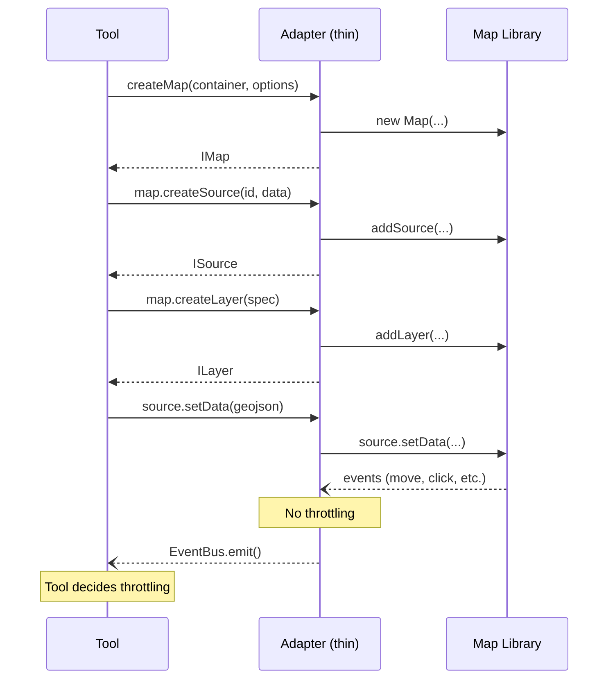
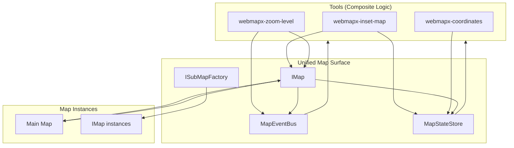

# 🛠️ Developer Experience (DX) Guide: Creating New Tools

This guide outlines the standard procedure for adding new tools to WebMapX while maintaining architectural consistency.

Before making changes, also read the short engineering checklist in [`docs/developer/engineering-rules.md`](./developer/engineering-rules.md).

---

## 0. Configuring the Map Library

WebMapX supports multiple mapping libraries through the adapter pattern. Built-in adapters currently include:

| Adapter | Library | Tile Size | Registration Names |
| :--- | :--- | :--- | :--- |
| MapLibre GL | `maplibre-gl` | 512px | `maplibre` (default) |
| OpenLayers | `ol` | 256px | `openlayers`, `ol` |
| Leaflet | `leaflet` | 256px | `leaflet`, `l` |
| Cesium | `cesium` | n/a | `cesium`, `c` |

### Setting the Adapter in HTML

Use the `adapter` attribute on `<webmapx-map>`:

```html
<!-- MapLibre GL (default) -->
<webmapx-map id="map-container"></webmapx-map>
<webmapx-map id="map-container" adapter="maplibre"></webmapx-map>

<!-- OpenLayers -->
<webmapx-map id="map-container" adapter="openlayers"></webmapx-map>
<webmapx-map id="map-container" adapter="ol"></webmapx-map>

<!-- Leaflet -->
<webmapx-map id="map-container" adapter="leaflet"></webmapx-map>
<webmapx-map id="map-container" adapter="l"></webmapx-map>

<!-- Cesium -->
<webmapx-map id="map-container" adapter="cesium"></webmapx-map>
<webmapx-map id="map-container" adapter="c"></webmapx-map>
```

### Runtime Adapter Switching

Users can switch adapters at runtime via the Settings tool. The preference is stored per map id in `localStorage` and the page reloads to reinitialize the map:

```javascript
// Programmatic adapter switching
localStorage.setItem('webmapx-adapter:map-container', 'openlayers');
window.location.reload();  // Required to reinitialize
```

**Priority order:** map-scoped runtime preference > `adapter` attribute on `<webmapx-map>` > resolved `map.type` > default (`maplibre`)

The `map.type` field is part of the JSON schema and now participates in runtime adapter selection when the element does not declare an explicit adapter.

### Zoom Level Normalization

Different map libraries use different tile sizes, causing zoom level differences:
- **MapLibre GL:** 512px tiles
- **OpenLayers/OSM:** 256px tiles
- **Leaflet/OSM:** 256px tiles
- **Cesium:** camera-height based rather than fixed tile zoom

WebMapX normalizes this internally with a `ZOOM_OFFSET = 1` for OpenLayers. This means:
- Logical zoom 4 in WebMapX = OL internal zoom 5
- Logical zoom 4 in WebMapX = Leaflet internal zoom 5
- When switching adapters, the same geographic extent is preserved
- Tools always receive consistent "logical" zoom values

### Available Adapters API

```typescript
import { getRegisteredAdapters, DEFAULT_ADAPTER_NAME } from './map/adapter-registry';

// Get list of registered adapters
const adapters = getRegisteredAdapters();  // ['maplibre', 'openlayers', 'ol', 'leaflet', 'l', 'cesium', 'c']

// Default adapter name
console.log(DEFAULT_ADAPTER_NAME);  // 'maplibre'
```

---

## I. Architecture Rules

1. **Adapter = Thin Wrapper:** Fixed methods/events only. Translates library-specific APIs to generic interfaces. **No business logic in adapter.**

2. **Tools = Composite Logic:** All calculations, orchestration, state management, and layer setup live in tools.

3. **Consumer-Side Throttling:** Adapter emits all events immediately. Tools use `throttle` utility as needed.

4. **Unified Map API:** The main engine surface is `IMap`; inset and helper maps are created via `ISubMapFactory` → `ISubMap` → `ISource` / `ILayer`

5. **Modal Tool Ownership:** `ToolManager` owns the active modal tool transition. Tools may call into the manager when invoked directly, but the manager writes the tool's `active` flag and the `activeTool` state entry itself.

## II. Data Flow


```mermaid
sequenceDiagram
    participant Tool
    participant Adapter as Adapter (thin)
    participant MapLib as Map Library

    Tool->>Adapter: createMap(container, options)
    Adapter->>MapLib: new Map(...)
    Adapter-->>Tool: IMap

    Tool->>Adapter: map.createSource(id, data)
    Adapter->>MapLib: addSource(...)
    Adapter-->>Tool: ISource

    Tool->>Adapter: map.createLayer(spec)
    Adapter->>MapLib: addLayer(...)
    Adapter-->>Tool: ILayer

    Tool->>Adapter: source.setData(geojson)
    Adapter->>MapLib: source.setData(...)

    MapLib--)Adapter: events (move, click, etc.)
    Note over Adapter: No throttling
    Adapter--)Tool: EventBus.emit()
    Note over Tool: Tool decides throttling
```

## III. Building a New Tool

### Step 1: Use Existing Adapter APIs

Most tools only need the existing adapter interfaces:

| Need | Use | Example |
| :--- | :--- | :--- |
| Create a sub-map | `map.mapFactory.createMap()` | Inset map, comparison view |
| Send tool command | `map.toolService.toggleTool()` | Engine-backed tool actions |
| Add GeoJSON layer | `map.createSource()` + `map.createLayer()` | Viewport rectangle, markers |
| React to map events | `map.events.on('view-change')` | Coordinates display |
| React to state | `map.store.subscribe()` | Sync with main map |
| Throttle updates | `throttle()` from utils | High-frequency handlers |

### Step 2: Build the Tool Component

Copy `webmapx-tool-template.ts` and implement your logic:

```typescript
import { throttle } from '../utils/throttle';

@customElement('webmapx-my-tool')
export class WebmapxMyTool extends LitElement {
  private map: IMap | null = null;
  private myMap: ISubMap | null = null;
  private unsubscribe: (() => void) | null = null;

  // Tool decides its own throttling
  private throttledUpdate = throttle((state: IAppState) => {
    this.handleStateChange(state);
  }, 50);

  protected firstUpdated(): void {
    this.map = resolveMapAdapter(this);
    if (!this.map) return;

    // Create sub-map using the map's sub-map factory
    this.myMap = this.map.mapFactory.createMap(container, {
      interactive: false,
      styleUrl: 'https://...'
    });

    // Setup layers when ready (composite logic in tool)
    this.myMap.onReady(() => {
      const source = this.myMap!.createSource('data', emptyGeoJSON);
      this.myMap!.createLayer({ id: 'fill', type: 'fill', sourceId: 'data' });
    });

    // Subscribe with throttling
    this.unsubscribe = this.adapter.store.subscribe((state) => {
      this.throttledUpdate(state);
    });
  }

  disconnectedCallback(): void {
    this.unsubscribe?.();
    this.myMap?.destroy();
    super.disconnectedCallback();
  }
}
```

### Step 3: Key Patterns

**Creating Maps:**
```typescript
const map = adapter.mapFactory.createMap(container, {
  center: [0, 0],
  zoom: 2,
  styleUrl: 'https://...',
  interactive: false  // for passive maps like insets
});
```

**Creating Sources and Layers:**
```typescript
map.onReady(() => {
  const source = map.createSource('my-source', {
    type: 'FeatureCollection',
    features: []
  });

  map.createLayer({
    id: 'my-fill',
    type: 'fill',
    sourceId: 'my-source',
    paint: { 'fill-color': '#0f62fe', 'fill-opacity': 0.15 }
  });

  // Update data later
  source.setData(newGeoJSON);
});
```

**Subscribing to Events:**
```typescript
// Via EventBus (for map events)
adapter.events.on('view-change-end', (e) => {
    console.log(`View changed to ${e.center}, zoom ${e.zoom}`);
});

// Via Store (for state)
adapter.store.subscribe((state) => {
  if (state.mapCenter) {
    // React to center change
  }
});
```

**Tracking the Active Tool:**
```typescript
if (state.activeTool?.toolId === 'measure') {
  // measure tool is active
}
```

**Throttling (tool decides):**
```typescript
import { throttle } from '../utils/throttle';

private throttledHandler = throttle((data) => {
  this.expensiveOperation(data);
}, 50);  // 50ms throttle
```

## IV. What NOT to Do

❌ **Don't add business logic to adapter services**
```typescript
// BAD - logic in adapter
class MapFactoryService {
  createMap() {
    const zoom = this.calculateOptimalZoom();  // NO!
  }
}
```

❌ **Don't import map libraries in tools**
```typescript
// BAD - direct library import
import * as maplibregl from 'maplibre-gl';  // NO!
```

❌ **Don't add throttling in adapter**
```typescript
// BAD - throttling in adapter
class MapCoreService {
  private throttledEmit = throttle(...);  // NO!
}
```

✅ **Do put all logic in tools, use adapter as thin wrapper**

## V. Architecture Overview


```mermaid
flowchart TB
    subgraph Tools["Tools (Composite Logic)"]
        INSET["webmapx-inset-map"]
        ZOOM["webmapx-zoom-level"]
        COORDS["webmapx-coordinates"]
    end

    subgraph Adapter["Unified Map Surface"]
      MAINMAP["IMap"]
      FACTORY["ISubMapFactory"]
        EVENTS["MapEventBus"]
        STORE["MapStateStore"]
    end

    subgraph Maps["Map Instances"]
        MAIN["Main Map"]
        IMAP["IMap instances"]
    end

    %% Tools use adapter
    INSET --> MAINMAP
    INSET --> STORE
    ZOOM --> MAINMAP
    ZOOM --> EVENTS
    COORDS --> STORE

    %% Factory creates maps
    FACTORY --> IMAP

    %% Unified map manages main map
    MAINMAP --> MAIN
    MAIN --> MAINMAP

    %% Events flow
    MAINMAP --> EVENTS
    MAINMAP --> STORE
    EVENTS --> Tools
    STORE --> Tools
```

### Component Responsibilities

| Component | Role | Location |
| :--- | :--- | :--- |
| **Tools** | All composite logic, calculations, layer setup, throttling | `src/components/` |
| **IMap** | Main map interface with state, events, viewport, and source/layer operations | `src/map/IMapInterfaces.ts` |
| **ISubMapFactory** | Creates `ISubMap` instances (thin wrapper around map library) | `src/map/IMapInterfaces.ts` |
| **ISubMap** | Sub-map instance with `setViewport`, `createSource`, `createLayer`, `destroy` | `src/map/IMapInterfaces.ts` |
| **ISource** | GeoJSON source with `setData` method | `src/map/IMapInterfaces.ts` |
| **ILayer** | Layer with `getSource`, `remove` methods | `src/map/IMapInterfaces.ts` |
| **MapCoreService** | Translates map-library events to generic events (thin) | `src/map/*-services/` |
| **MapEventBus** | Emits normalized events (`view-change`, `click`, etc.) | `src/store/map-events.ts` |
| **MapStateStore** | Holds app state, notifies subscribers | `src/store/map-state-store.ts` |

### Adding New Map Library Support

To add support for a new map library (e.g., Leaflet, Cesium), follow this pattern (using OpenLayers as reference):

#### Step 1: Create the Services Directory

```
src/map/{library}-services/
├── MapCoreService.ts      # Main map + events
├── MapFactoryService.ts   # IMap/ISource/ILayer implementations
└── MapServiceTemplate.ts  # Tool service (optional)
```

#### Step 2: Implement MapCoreService

Implements the internal core behavior used by the public `IMap` surface. It handles main map initialization and event normalization:

```typescript
// src/map/leaflet-services/MapCoreService.ts
import { IMapCore } from '../IMapInterfaces';
import { MapStateStore } from '../store/map-state-store';
import { MapEventBus } from '../store/map-events';

export class MapCoreService implements IMapCore {
    private mapInstance: L.Map | null = null;

    // Zoom offset if library uses different tile sizes
    private static readonly ZOOM_OFFSET = 1;  // Leaflet uses the same +1 logical zoom offset as OpenLayers

    constructor(
        private readonly store: MapStateStore,
        private readonly eventBus?: MapEventBus
    ) {}

    public initialize(containerId: string, options?: {...}): void {
        // Create map instance
        // Attach event listeners
        // Dispatch to store and eventBus
    }

    public getViewportState(): { center, zoom, bearing } { ... }
    public setViewport(center, zoom): void { ... }
    public setZoom(level): void { ... }
    public getZoom(): number { ... }
}
```

#### Step 3: Implement MapFactoryService

Implements `ISubMapFactory`, `ISubMap`, `ISource`, `ILayer`:

```typescript
// src/map/leaflet-services/MapFactoryService.ts

class LeafletSource implements ISource {
    constructor(public readonly id: string, private layer: L.GeoJSON) {}
    setData(data: GeoJSON.FeatureCollection): void {
        this.layer.clearLayers();
        this.layer.addData(data);
    }
}

class LeafletLayer implements ILayer {
    constructor(public readonly id: string, private layer: L.GeoJSON) {}
    getSource(): ISource { return new LeafletSource(this.id, this.layer); }
    remove(): void { this.layer.remove(); }
}

class LeafletMap implements ISubMap {
    setViewport(center, zoom, bearing?, pitch?): void { ... }
    createSource(sourceId, data): ISource { ... }
    getSource(sourceId): ISource | null { ... }
    createLayer(spec: LayerSpec): ILayer { ... }
    getLayer(layerId): ILayer | null { ... }
    onReady(callback): void { ... }
    destroy(): void { ... }
}

export class MapFactoryService implements ISubMapFactory {
  createMap(container: HTMLElement, options?: MapCreateOptions): ISubMap {
    // Create Leaflet map, return wrapped ISubMap
    }
}
```

#### Step 4: Create the Adapter

Compose services into the unified `IMap`:

```typescript
// src/map/leaflet-adapter.ts
import { IMap } from './IMapInterfaces';
import { MapStateStore } from '../store/map-state-store';
import { MapEventBus } from '../store/map-events';
import { MapCoreService } from './leaflet-services/MapCoreService';
import { MapFactoryService } from './leaflet-services/MapFactoryService';

export class LeafletAdapter implements IMap {
    public readonly store: MapStateStore;
    public readonly events: MapEventBus;
  public readonly mapFactory: ISubMapFactory;

    constructor() {
        this.store = new MapStateStore();
        this.events = new MapEventBus();
    this.core = new MapCoreService(this.store, this.events);
        this.mapFactory = new MapFactoryService();
    }
}
```

#### Step 5: Register in adapter-registry.ts

```typescript
// src/map/adapter-registry.ts
import { LeafletAdapter } from './leaflet-adapter';

registerMapAdapter('leaflet', async () => new LeafletAdapter());
registerMapAdapter('l', async () => new LeafletAdapter());  // optional alias
```

#### Step 6: Handle Zoom Normalization

If the library uses different tile sizes than MapLibre (512px), add zoom offset:

| Library | Tile Size | ZOOM_OFFSET |
| :--- | :--- | :--- |
| MapLibre GL | 512px | 0 (reference) |
| OpenLayers | 256px | +1 |
| Leaflet | 256px | +1 |
| Cesium | varies | camera-height based, not a fixed offset |

Apply offset in all zoom-related methods:
- `toLibraryZoom(logical)` = `logical + ZOOM_OFFSET`
- `fromLibraryZoom(internal)` = `internal - ZOOM_OFFSET`

#### Result

**Tools stay unchanged** - they only use the interfaces (`IMap`, `ISource`, `ILayer`), not the implementations. Users can switch libraries via the `adapter` attribute or Settings UI, while the runtime resolves the adapter through the map-scoped preference path above.
